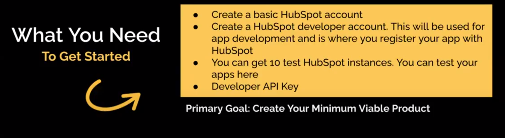

[🔙 << Class 2](../02_Class/02_Class.md) | [Class 4 >>](../04_Class/04_Class.md)

[🔙 Back](../README.md)

# Setting up a Developer Account
## The first step in putting your idea into action

## To set up a developer account for HubSpot, follow these steps:

1. Visit the HubSpot Developer Website: Go to the HubSpot Developer website at developers.hubspot.com.

2. Sign Up or Log In: If you already have a HubSpot account, log in using your credentials. If you don't have an account, click on the "Get Started" or "Sign Up" button to create a new account.

3. Access the Developer Dashboard: Once you're logged in, navigate to the developer dashboard. This is where you can manage your developer account, create and configure apps, and access documentation and resources.

4. Create a New App: In the developer dashboard, look for the option to create a new app. Click on it to start the app creation process.

5. Provide App Details: Fill in the required details for your app, such as the app name, description, logo, and website URL. You may also need to specify the type of app you're creating (e.g., integration, custom integration, or OAuth).

6. Configure App Permissions: Choose the necessary permissions for your app based on the features and functionality you plan to implement. These permissions will determine the level of access your app has to HubSpot's APIs and data.

7. Set Up Callback URLs and Webhooks: If your app requires callback URLs or webhooks, specify them in the app configuration. These are used to receive authentication tokens and notifications from HubSpot.

8. Test and Review: Before your app can be used in a live environment, you may need to go through a testing and review process to ensure it meets HubSpot's guidelines and standards. Follow the provided instructions to complete this process.

9. Publish Your App: Once your app has been tested and approved, you can publish it to make it available to HubSpot users. This will allow them to install and use your app within their HubSpot accounts.

[🔙 << Class 2](../02_Class/02_Class.md) | [Class 4 >>](../04_Class/04_Class.md)
