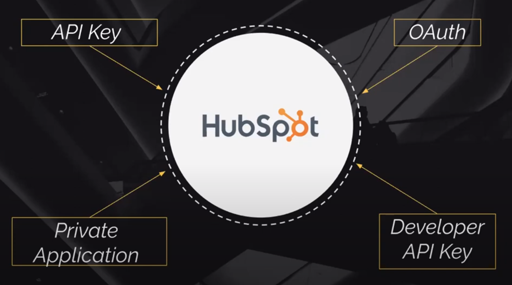

[🔙 << Class 3](../03_Class/03_Class.md) | [Class 5 >>](../05_Class/05_Class.md)

[🔙 Back](../README.md)

# How will you connect your App to HubSpot
## What's the best way for users to access your app?

## HubSpot:
- **API Key:**
  - **Permissions Granted:** The API Key grants the user full access to the entire HubSpot instance, essentially functioning as a "GOD mode" with broad access permissions. However, please note that this authentication method is not preferred and will be deprecated in the future.
  - **Use Case:** The API Key is a good fit for initial development when you want to quickly start working with the HubSpot APIs and haven't determined the specific permissions you'll need yet.
  - **Transition to Other Methods:** It's important to plan for transitioning away from API Key authentication to a more permanent and secure method in the future. As part of your internal security policies, the API Key should be rotated periodically to maintain security.
  - **Generating an API Key:** You can generate an API key in your HubSpot account by navigating to Settings -> Integrations -> API key.
  - **Usage:** API keys are commonly used for server-to-server integrations or when accessing the HubSpot APIs from scripts or command-line tools.

- **OAuth:**
  - **Permissions Granted:** OAuth grants limited access to HubSpot based on the permissions set by the development team. The access tokens obtained through OAuth may need to be replaced periodically for security reasons.
  - **Use Case**: OAuth is a good fit when you're creating a new app for public use and want to ensure that your app only accesses a user's HubSpot account with their explicit consent. This helps mitigate risks for both parties involved. OAuth is also required for app certification.
  - **Managing API Limits**: If you ever encounter API limits, you can create another HubSpot app using OAuth. API limits are based on the combination of the user and the app, so creating a new app allows you to have separate API limits for different users.
  - **Secure and Recommended Method**: OAuth is a more secure and recommended authentication method for third-party integrations with HubSpot.
  - **How it Works**: To use OAuth, you need to create an app in the HubSpot Developer Dashboard and configure the necessary OAuth scopes and redirect URLs.
  - **Authorization and Access Tokens**: When a user authorizes your app, you receive an access token, which you can use to make API requests on their behalf.
  - **Use Cases**: OAuth is commonly used for applications that require access to specific user data and need to authenticate as individual users.
  OAuth provides a more granular and secure approach to accessing HubSpot data, as users have control over which apps can access their accounts.

- **Private Application:**
  - Private applications are a type of OAuth application that allows you to authenticate and access your own HubSpot account data.
  - You can create a private application in the HubSpot Developer Dashboard.
  - Private applications use OAuth 2.0 for authentication, similar to other OAuth integrations.
  - Private applications are useful when you want to automate tasks or build custom functionality within your own HubSpot account.

- **Developer API Key:**
  - Developer API keys are used specifically for accessing certain HubSpot APIs that require additional permissions.
  - These keys are generated in the HubSpot Developer Dashboard and provide access to APIs like the CMS API or Ecommerce Bridge API.
  - Developer API keys are separate from the regular API keys and provide more granular control over access to specific APIs.

[🔙 << Class 3](../03_Class/03_Class.md) | [Class 5 >>](../05_Class/05_Class.md)
