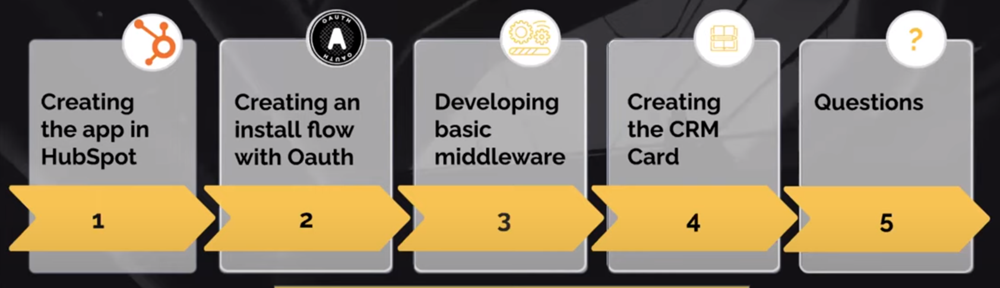
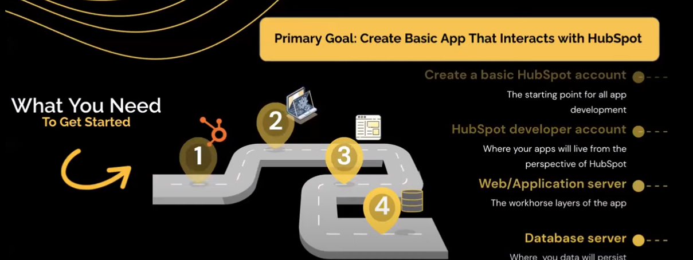

# HubSpot-Developer
## Session 01
## What we're Discussing
- Translating  you concept into an Viable App
- Setting up a Developer Account
- How you will Connect you app to HubSpot
- Development and Business considerations
- Questions

| Class | Content |
|-------|-----------|
|   1   | [Important Initial Questions](./Session_01/01_Class/01_Class.md) |
|   2   | [You must be realistic about](./Session_01/02_Class/02_Class.md) |
|   3   | [Setting up a Developer Account](./Session_01/03_Class/03_Class.md) |
|   4   | [How will you connect your App to HubSpot](./Session_01/04_Class/04_Class.md) |

## Session 02
## What we're Discussing

## What you need to get Started

